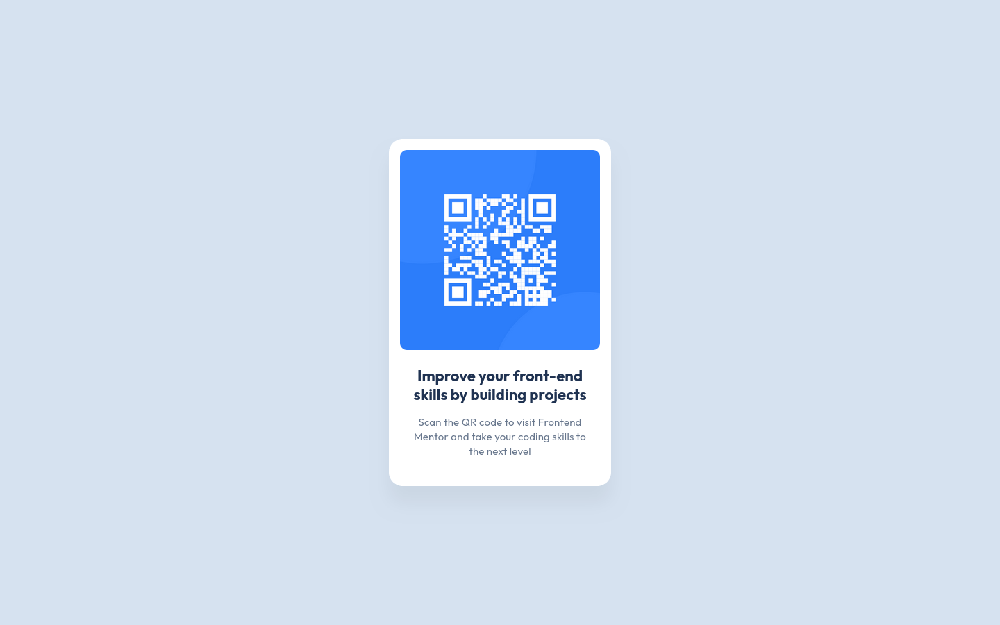

# Frontend Mentor - QR code component solution

This is a solution to the [QR code component challenge on Frontend Mentor](https://www.frontendmentor.io/challenges/qr-code-component-iux_sIO_H). Frontend Mentor challenges help you improve your coding skills by building realistic projects. 

## Table of contents

- [Overview](#overview)
  - [Screenshot](#screenshot)
  - [Links](#links)
- [My process](#my-process)
  - [Built with](#built-with)
  - [What I learned](#what-i-learned)
  - [Continued development](#continued-development)
  - [Useful resources](#useful-resources)
  - [AI Collaboration](#ai-collaboration)
- [Author](#author)
- [Acknowledgments](#acknowledgments)

## Overview

### Screenshot

### Links

- Solution URL: [GitHub Repository](https://github.com/brcg-do/qr-code-component)
- Live Site URL: [View live site](https://brcg-do.github.io/qr-code-component/)

## My process

### Built with

- Semantic HTML5 markup
- CSS custom properties
- Flexbox
- Mobile-first workflow

### What I learned

During the development of this project, I reinforced key concepts of semantic HTML, responsive CSS, and accessibility. Below, I detail the most relevant lessons learned and decisions:

- **Why do I use `<main>`?** I use the `<main>` tag because it contains the unique and important content of my page. By doing so, I create a landmark that facilitates navigation for people with visual impairments.

- **Does the `<main>` tag have to start with a heading element?** From the perspective of the HTML standard (WHATWG/W3C specification), the `<main>` tag does not necessarily require a heading (`<h1>`-`<h6>`) inside it for the code to be syntactically valid.

- **Why use `<article>` for the card?** I use the `<article>` tag because the card contains self-contained and independent information. If extracted from the rest of the page, its content is perfectly understandable on its own.

- **Can the `<article>` tag be used without heading elements?** The HTML specification does not require you to include a heading inside a `<article>`.

- **Using Header Tags in Isolated Components?** I chose `<h1>` simply because the component works in isolation; if it were part of a more complex structure or interface, I would change the tag to the appropriate hierarchical level.

- **Responsive Images:** I apply `max-width: 100%` and `height: auto` so that the images adapt to the width of their container while maintaining their original height.

- **Why Use `max-width` Instead of a Fixed Width to Avoid Horizontal Scrolling?** I defined the card with a fluid width using `max-width: 320px` instead of a fixed width `width: 320px`.

  If I fixed the width to exactly 320px, the card would maintain that rigid measurement on extremely small screens or within narrow containers, causing horizontal overflow and forcing the user to scroll horizontally.

- **Removing the Small Space Below Images with `display: block;`:** This is caused by the default CSS behavior, where images are inline elements and align with the baseline of the text.

- **How ​​to Prevent a Centered Card from Being Cut Off on Small Screens:** I was trying to center a card with Flexbox using `height: 100vh`, but on 320x568 screens, the entire card wasn't visible and was cut off, preventing scrolling. I solved this by changing to `min-height: 100vh` in the `body`, because it sets a minimum size without imposing a maximum limit.

- **Why I Chose `rem`: Accessibility and Scalability**
I used **`rem`:** to ensure the design is fully accessible and consistent, allowing fonts and box sizes to scale cleanly and proportionally if the user changes the default text size in their browser, while also avoiding the exponential calculation problems caused by cascading.

- **`em` for Letter-Spacing:** I used **`em`** for letter-spacing because it's the unit that keeps the spacing between letters always proportional to the text size. This way, if the font size changes on different screens or elements, the character spacing adjusts automatically, maintaining the same harmony and readability without having to manually redefine it.

- **Reasons to explicitly declare `font-weight` in CSS, even if it matches a browser's default values:** I explicitly declared `font-weight` to ensure that the title and description maintain the exact same font weight in any browser, preventing variations in weight across different browsers.

### Continued development

In future projects, I want to keep refining my approach to semantic structure and advanced responsive layouts. Specifically, I plan to focus on:

- **CSS Grid:** Getting more comfortable using CSS Grid to build structured, complex layouts efficiently and cleanly.

- **Accessibility (a11y):** Diving deeper into ARIA roles and keyboard navigation patterns beyond basic HTML semantics.

- **Fluid Typography:** Exploring CSS functions like `clamp()` for smoother fluid layouts without over-relying on media queries.

### Useful resources

- [MDN Web Docs](https://developer.mozilla.org/en-US/) - Essential documentation for semantic HTML, accessibility standards, and modern CSS rules.

- [freeCodeCamp News](https://www.freecodecamp.org/news/) - Excellent resource for clear, step-by-step guides on responsive design and best practices.

### AI Collaboration

I used AI (Gemini) primarily as a quick reference tool to clarify small technical doubts as they came up.

Rather than using it to write code or generate layouts, I relied on it to double-check my logic on specific concepts like image baseline alignment, responsive units, and semantic tag choices. This allowed me to learn actively while keeping full control over my code.

## Author

- Frontend Mentor - [@brcg-do](https://www.frontendmentor.io/profile/brcg-do)

## Acknowledgments

A special thanks to **freeCodeCamp** for their incredible free resources, detailed tutorials, and community guides. Their content helped me understand core web development concepts and best practices that I applied throughout this project.

